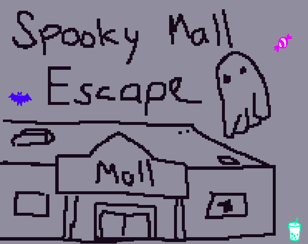
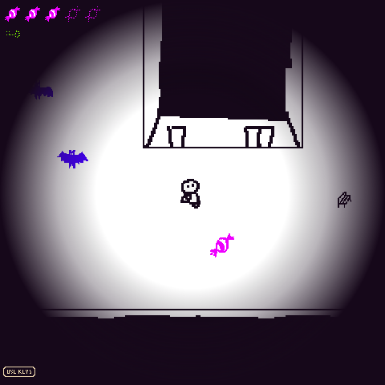
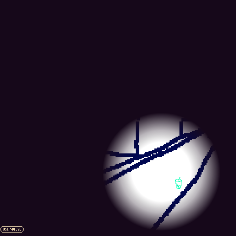

This was made as part of the [Spooky 2D Jam](https://itch.io/jam/spooky-2d-jam-24) on itch.io.

**Theme:** alone

**Timeframe:** 48 hours

# Spooky Mall Escape

## Idea

What place is spooky when you're alone? a mall!

I needed a reason for you to be be walking around in a mall, so its a simple generated maze, with a minigame where you enter shops to look for a key.

I wanted to add batteries to add time pressure, and jump scares to make it scarier, but I didn't have time

## Building the project

* `npm run start` will build and host it on http://localhost:800/index.html
* `npm run build` will build the release (grab everything in the `www` folder)

## What you'll find

* `maze.ts` A Generator Function to make mazes, and a lazy implementation of Dijkstra's algorithm
* `sound.ts` mostly ripped from my Dog Castle game, uses the Web Audio API to make some basic soudn effects
* `keyboard.ts` the pattern I use for keyboard controls in vanilla js
* `arr2.ts` a 2D array with utility functions to loop through the values, or generate them (useful for the maze) 
* `render.ts` has logic to split up `tiles.png` and render the right sub-tiles to seamlessly construct the maze. Pretty complex (and its only a rough implementation here) so its wortha blogpost eventually

## More Screenshots

